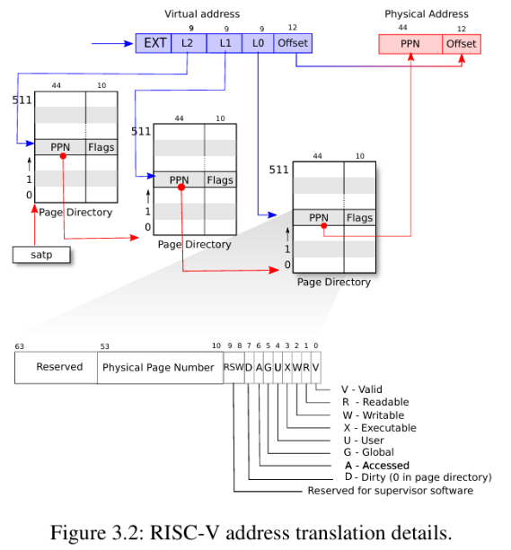

# MyOS
## Lab1 熟悉开发环境
主要工作是利用常见的系统调用编写代码（sleep、pingpong、find、xargs）
### pingpong
通过管道实现父进程和子进程之间的简单通信。父进程发送一个字符给子进程，子进程接收到后再发送回给父进程，父进程接收到子进程的回复后并打印。

## Lab2 系统调用
该实验主要用以熟悉系统调用的流程，了解系统调用的步骤，然后为此操作系统新增系统调用函数。

### System Call tracing 
此系统调用用以跟踪用户程序的系统调用，并将调用的相关信息打印出来，具体实现如下：
- 在进程结构体中添加一个变量用以记录需要跟踪的系统调用的编号，每一个系统调用都对应着一个系统调用编号。
- 通过trace系统调用（本实验实现的）传入需要监控的系统调用。
- 在内核函数syscall中加入判断逻辑，如果此时进程的系统调用号是监控调用号，则打印进程号，系统调用函数名，系统调用号

### sysinfo 用来获取空闲的内存、已创建的进程数量
这个系统调用的功能是将当前空闲内存的数量和已创建的进程数量存储至当前进程的某个虚拟地址空间，进程的虚拟空间是用户态，而系统调用属于内核态，因此需要使用xv6实现的函数copyout将内核态数据复制到用户态
- 通过遍历kmem.freelist查看链表的节点数量即可知道当前空闲的内存有哪些。
- 遍历proc[NPROC]数组查看进程状态p->state不为unused的即为已创建的进程，统计数量。
- 将上面两步的计算结果保存在xv6预定义的结构体sysinfo info中
- 使用copyout(myproc()->pagetable, dstaddr, (char*)info, sizeof(info))将内核空间结构体info的内容复制到用户态地址空间dstaddr中。

## Lab3 页表
xv6基于Sv39 RISC-V运行，它只使用64位虚拟地址的低39位，虚拟地址的前27位用于索引页表，xv6是三级页表，寻址过程使用walk函数实现，页表在逻辑上视作由$2^{27}$个页表条目(PTE)组成的数组，数组存着44位的物理页码(PPN)。

地址转换过程为：使用虚拟地址的前27位在页表中查找对应的PTE，然后根据PTE中的PPN的44位物理地址页表与12位的偏移量（1页4KB，长度为$2^{12}$字节）组成一个56位的物理地址。由于一个页表是4KB，一个PTE保存的值是8字节即页表可以看成数组
$$uint64\,pagetable[PTE] = PPN$$
所以一个页表能保存的数组长度为512个（4*1024/8 = 512），因此只能存9位的PTE，因此需要三级页表才能表示27位的索引，前两级页表的PPN是下一级页表的物理地址，最后一级页表的PPN表示的才是最终物理地址页表。walk函数的工作流程如下图所示。

### print a page table
需要模拟查询页表的过程，对三级页表进行遍历并打印，模仿下列函数打印即可：

    void freewalk(pagetable_t pagetable)
    {
        // there are 2^9 = 512 PTEs in a page table.
        for(int i = 0; i < 512; i++){
            pte_t pte = pagetable[i];
            if((pte & PTE_V) && (pte & (PTE_R|PTE_W|PTE_X)) == 0){
                // this PTE points to a lower-level page table.
                uint64 child = PTE2PA(pte);
                freewalk((pagetable_t)child);
                pagetable[i] = 0;
            } else if(pte & PTE_V){
                panic("freewalk: leaf");
            }
        }
        kfree((void*)pagetable);
    }
`(pte & PTE_V)`表示这个页表项被写入数据了，是有效的页表项。而`pte & (PTE_R|PTE_W|PTE_X)`表示这个页表项的内容是虚拟地址对应物理地址还是下一级页表的物理地址（1为前者，0为后者）

### A kernel page table per process
原本的xv6操作系统中每个进程是共用一个内核页表的。如果出现一个恶意进程篡改了内核页表的数据，那么其他进程运行程序的时候都会受影响，如果每个进程进入内核态之后都能有自己独立的内核页表，可以避免上述问题的发生

- 处理这个问题首先得在内核结构体中添加新的成员`kernel_pagetable`用以保存内核态的页表，内核进程需要依赖内核页表的一些固定映射才能正常工作，例如UART控制、硬盘界面、中断控制等等，
- 原本`kvminit()`的逻辑是将所有进程共用的内核页表进行初始化，现在需要对其进行修改，修改成对pagetable_t变量进行初始化，使得每个进程可以对其自己拥有的内核页表进行内核页表初始化
- 类似上述的逻辑，还要将下列函数抽象化，使得这些函数从处理全局共享内核页表变为处理进程的pagetable_t变量：`kvmmap`将内核虚拟地址与物理地址建立映射关系；`kvmpa`将内核虚拟地址翻译为物理地址；
- 在`procinit()`函数执行时，会遍历proc数组，为每个proc分配一个内核栈，这部分的逻辑是映射至全局内核页表，我们现在废除这部分逻辑，应该变为在分配进程的时候在进程的独有内核页表使用`kvmmap(p->kpagetable, KSTACK, (uint64)pa, PGSIZE)`分配内核栈
- 在调度器逻辑中，一旦需要进入内核态，就应该将页表替换为进程独有的页表，也就是使用`w_satp(p->kpagetable)`写入satp寄存器，从而切换页表
- 进程结束后需要做如下工作：释放内核栈；递归释放进程独享的页表，但是不能释放掉内核页表指向的物理页，因为内核的核心数据（设备驱动，中断处理代码那些）是每个进程内核页表都需要映射的，因此只需释放页表而不需要释放页表指向的物理地址。

### simplify copyin/copyinstr
该实验需要将用户态的映射添加到每个进程的内核页表，也就是将用户态的页表复制到内核态的页表。这样做的目的是使得内核态也可以对用户态传进来的指针（逻辑地址）进行解引用。
- `copyin`：让内核用用户态程序的内存中安全读取数据
- `copyinstr`：让内核从用户态程序的内存中安全读取字符串
相比原来的方案，原来的`copyin`是通过软件模拟访问页表的过程获取物理地址，而在内核页表内维护映射副本的话，可以利用CPU的硬件寻址功能进行寻址，效率更高

## Lab4 中断处理
当程序执行系统调用、遇到page fault、中断的时候，都会发生用户空间和内核空间的切换，这种切换被称为trap

### RISC-V寄存器概述
1. stvec：内核在这里写入trap处理程序的地址
2. sepc：trap发生时，RISC-V保存程序的pc值
3. scause：RISC-V放置一个描述trap原因的数字
4. sscratch：保存当前用户进程trapframe结构体的用户虚拟地址
5. sstatus：里面有一位SIE用于标识能否接收中断

### trap发生后计算机的工作流程（硬件部分）
1. 清除SIE禁用中断
2. 将pc复制到sepc
3. 将当前模式（用户模式，管理模式）保存在sstatus的SPP位
4. 设置scause记录产生trap的原因
5. 将模式设置为管理模式
6. 将stvec的值复制到pc上
7. 在新的pc上开始执行

### 软件处理流程
### trap入口`uservec`（保存在stvec中）
1. 保存用户寄存器并切换到内核执行环境
2. 保存所有用户寄存器到trapframe，并加载内核环境（**恢复内核栈指针，内核页表**）
3. 跳转至usertrap
### 陷阱分发`usertrap`
主要作用是根据scause判断陷阱类型，并调用对应的处理函数

1. 保存sepc至trapframe->epc，防止嵌套trap修改返回地址
2. 将stvec寄存器存的函数改为kernelvec(当前在内核态，对应处理trap的函数也不同)
3. 通过scause寄存器的值判断是什么原因触发了trap（系统调用[调用syscall]，设备中断[调用devintr]，异常[kill进程]）
4. 调用usertrapret()返回用户态

### **usertrapret() & userret()返回用户态**
### usertrapret()
1. 关闭中断，防止竞争
2. 设置stvec重新指向uservec（usertrap函数内部改成kerneltrap，需要切换回来）
3. trapframe->epc存入sepc寄存器中，为后续sret指令将sepc的值赋值给pc恢复到trap发生的指令位置做准备。
4. 设置userret()函数的传参，第一个参数(存放至a0寄存器)是trapframe地址，第二个参数(存放至a1寄存器)是用户页表
5. 调用userret()

### userret()
1. 切换页表为用户页表(csrw satp, a1)
2. 将trapframe事先保存的寄存器值重新写入寄存器
3. 将trapframe的地址从a0写入sscratch寄存器
4. 调用sret指令，返回trap发生时候的pc处

### backtrace
该实验实现打印曾经调用过的函数的返回地址，打印出调用栈
- `r_fp()`：用于获取当前函数的栈帧，fp指向当前栈帧的开始地址，sp指向当前栈帧的结束地址，fp是高地址，sp是低地址，栈向低地址扩增
- 压栈的时候函数的返回地址保存在fp - 8的位置（比如说在函数A中调用了函数B，那么B的栈帧中fp - 8的位置保存着A的返回地址），而函数的栈帧地址保存在fp - 16的位置
- 该实验的解决方案是先获取当前fp，打印fp - 8保存的值`*(fp - 8)`，然后将fp的值重新赋值为`fp = *(fp - 16)`，依次迭代，直到fp变成页边界的时候`PGROUNDDOWN(fp) == PGROUNDUP(fp)`返回（因为栈帧最少会包含fp - 8和fp - 16，如果fp处于页边界（页的起始位置），那么fp，fp - 8，fp - 16三者会处于跨页的状态，这是操作系统不允许的。因此可以使用这个方式判断当前地址是否是fp

### alarm
该实验需要实现两个系统调用`sigalarm`和`sigreturn`。`sigalarm`用于注册alarm触发时要调用哪个函数，`sigreturn`用于恢复被信号中断前的执行状态，让进程在信号处理函数执行完毕后，能正确回到原来的代码位置继续执行。
- 需要额外添加成员变量来保存alarm触发的函数、触发的间隔interval、时钟计数ticks、跳转之前需要保存trapframe以便执行完触发函数之后sigreturn能恢复调用前现场
- sigreturn系统调用主要实现的功能就是恢复trapframe，清空时钟计数
具体的跳转逻辑需要在usertrap中实现，时钟本身就是一种中断形式，因此只要在`if(which_dev == 2)`中添加处理逻辑即可，具体实现代码如下：
    
    // alarm logic
    if(which_dev == 2) {
      p->tick++;
      if(p->tick >= p->intervel && p->intervel != 0 && p->alarm_lock == 0) {
        p->tick = 0;
        p->alarm_lock = 1;
        *(p->trapframe_copy) = *(p->trapframe);
        p->trapframe->epc = (uint64)p->handler;
      }
      yield();
    }

## Lab5 惰性分配
惰性分配是为了优化内存使用，操作系统先假装分配，实际不立即分配物理内存。等到真正访问这个地址的时候才会真正分配物理内存给该空间。惰性分配的设计导致出现更多的page fault。

当出现page fault的时候，xv6会将这个地址保存在stval寄存器中，并且这个异常会触发trap机制，让操作系统处理这个异常，这个时候需要我们实现为这个虚拟地址分配一个真正的物理地址。

写时复制技术是一种内存优化技术，多个进程（比如子进程和父进程），他们很多数据都是一致的，如果为子进程将每一个页都进行拷贝的话，假设这些页子进程和父进程只是访问并不做修改，那么复制就十分浪费内存空间。因此引入一个COW(copy on write)机制，当使用fork进行创建子进程的时候，并不复制所有物理页面，而是将页面全都标记为可读不可写。当子进程或父进程需要改写这些页面的时候，内核会捕获到异常，此时再为对应进程重新分配一个复制页，并将对应页修改为可读可写的权限。

